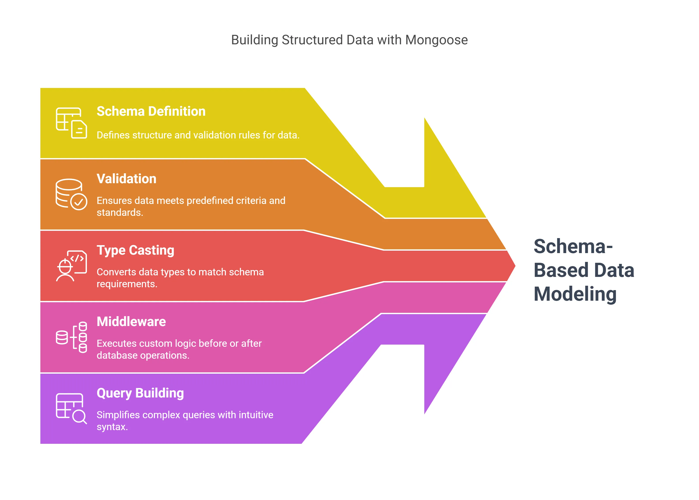

Your Code
  ↓
Mongoose
  ↓
MongoDB Node.js Driver
  ↓
MongoDB Server (mongod)

Why Mongoose Exists (The Actual Problem It Solves)

Mongoose was created because JavaScript applications need deterministic data contracts, while MongoDB is intentionally flexible.

Schema vs Model — Internal Meaning (Not Definitions)
4.1 Schema (Blueprint + Rule Engine)

A Schema is:

A pure JavaScript object

A rule book

A validator compiler

A type-casting specification

It does NOT touch the database.

const userSchema = new mongoose.Schema({
  email: { type: String, required: true },
  age: { type: Number, min: 18 }
});

Internally, Mongoose converts this into:

Path definitions

Validators array per path

Cast functions per path

Default setters

Getter/setter chains

Schema does NOT:

Insert data

Query data

Store data

Enforce DB rules

Internally Mongoose has these layers:
Schema
 ├── Paths
 ├── Validators
 ├── Types
 ├── Hooks
 └── Virtuals

Model
 ├── Document class
 ├── Query builder
 ├── Middleware executor
 └── Driver adapter

Connection
 ├── MongoClient
 └── db.collection()

Lifecycle of a Save Operation (Critical Section)

Let’s follow this line:

await new User({ age: "20" }).save();

Step-by-step execution

Document creation

Raw JS object wrapped into a Mongoose Document

_doc internal object created

Type casting

"20" → Number(20)

Happens before validation

Defaults applied

Only if field is missing

Validation engine runs

Required

Min/Max

Custom validators

Async validators

Middleware (pre-save)

pre('validate')

pre('save')

MongoDB driver call

collection.insertOne()

MongoDB server

BSON check

Optional schema validation

Write to disk

More precisely:

Mongoose validation protects your Node.js application

MongoDB validation protects the database itself

MongoDB does not know Mongoose exists

Mongoose cannot intercept data written by:

Mongo shell

Another microservice
Python / Go / Java client

Correct architecture in serious systems:

Client Validation (UI)
  ↓
Mongoose Validation (App boundary)
  ↓
MongoDB Validation (DB boundary)

Why?

Defense in depth

Multiple writers

Microservices

Data durability guarantees